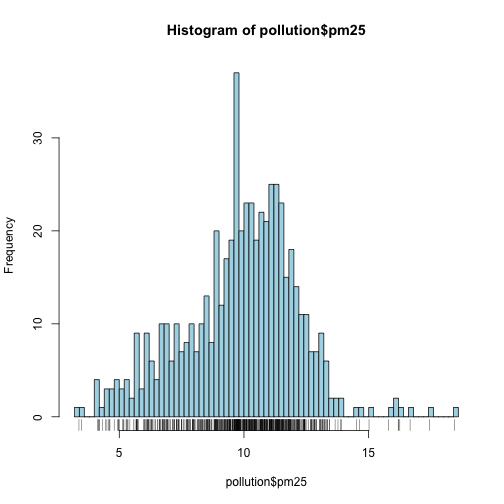
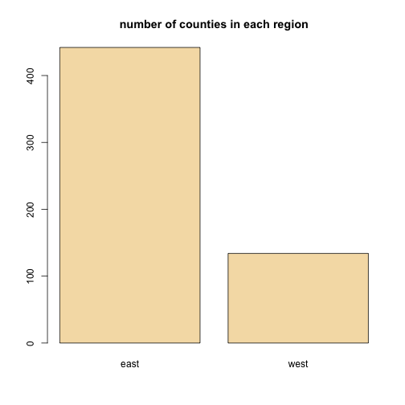
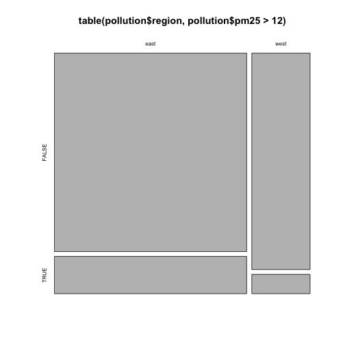
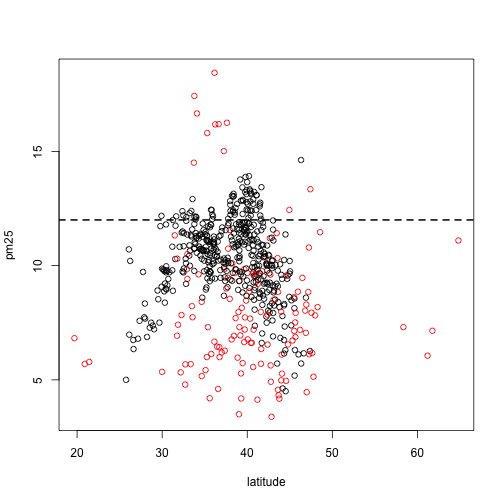

Week 1. Exploratory Data Analysis
=================================
Exploratory Graphs
-------------------
### One varialble

```r
pollution = read.csv('exploratoryGraphs/data/avgpm25.csv', colClasses = c('numeric','character','factor','numeric','numeric'))
head(pollution)
```

```
##     pm25  fips region longitude latitude
## 1  9.771 01003   east    -87.75    30.59
## 2  9.994 01027   east    -85.84    33.27
## 3 10.689 01033   east    -87.73    34.73
## 4 11.337 01049   east    -85.80    34.46
## 5 12.120 01055   east    -86.03    34.02
## 6 10.828 01069   east    -85.35    31.19
```

```r
# quantile
summary(pollution)
```

```
##       pm25           fips            region      longitude     
##  Min.   : 3.38   Length:576         east:442   Min.   :-158.0  
##  1st Qu.: 8.55   Class :character   west:134   1st Qu.: -97.4  
##  Median :10.05   Mode  :character              Median : -87.4  
##  Mean   : 9.84                                 Mean   : -91.7  
##  3rd Qu.:11.36                                 3rd Qu.: -80.7  
##  Max.   :18.44                                 Max.   : -68.3  
##     latitude   
##  Min.   :19.7  
##  1st Qu.:35.3  
##  Median :39.1  
##  Mean   :38.6  
##  3rd Qu.:41.8  
##  Max.   :64.8
```

```r
# boxplot
boxplot(pollution$pm25, col = 'lightblue')
abline(h=12)
```

 

```r
# histogram; add median and benchmark etc
hist(pollution$pm25, col = 'lightblue')
rug(pollution$pm25)
abline(v=12, lwd=2)
abline(v= median(pollution$pm25), col='purple', lwd=4)
```

 

```r
hist(pollution$pm25, breaks = 100, col = 'lightblue')
rug(pollution$pm25)
```

 

```r
# barplot with counts
barplot(table(pollution$region), col='wheat', main='number of counties in each region')
```

 

### Multivariable

```r
# flexible area plot
plot(table(pollution$region,pollution$pm25>12))
```

 

```r
# boxplot, using ~ for conditioning
boxplot(pm25~region, data=pollution)
```

 

```r
# hist, using par() for faceting
old.par = par()    # saving default par() first before changing
par(mfrow=c(2,1), mar=c(4,4,2,1))
hist(subset(pollution,region=='east')$pm25)
hist(subset(pollution,region=='west')$pm25)
```

 

```r
par(old.par)    # reset to par default setting
```

```
## Warning: graphical parameter "cin" cannot be set
## Warning: graphical parameter "cra" cannot be set
## Warning: graphical parameter "csi" cannot be set
## Warning: graphical parameter "cxy" cannot be set
## Warning: graphical parameter "din" cannot be set
## Warning: graphical parameter "page" cannot be set
```

```r
# scatter plot, using with() & col
with(pollution, plot(latitude, pm25, col=region))
abline(h=12, lwd=2, lty=2)
```

 

```r
# multi scatter plots
par(mfrow=c(1,2),mar=c(5,4,2,1))
with(subset(pollution,region=='west'), plot(latitude,pm25,main='West'))
with(subset(pollution,region=='east'), plot(latitude,pm25,main='East'))
```

 

```r
par(old.par)
```

```
## Warning: graphical parameter "cin" cannot be set
## Warning: graphical parameter "cra" cannot be set
## Warning: graphical parameter "csi" cannot be set
## Warning: graphical parameter "cxy" cannot be set
## Warning: graphical parameter "din" cannot be set
## Warning: graphical parameter "page" cannot be set
```

