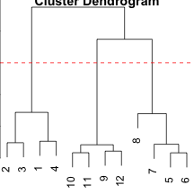

Week 3. Exploratory Data Analysis
=================================
Hierarchical Clustering
------------------------
Define close:
* continuous - euclidean distance
* continuous - correlation simalirity
* binary - manhattan distance

```r
set.seed(1234)
old.par = par()
par(mar = c(0,0,0,0))
x = rnorm(12, mean = rep(1:3, each=4), sd=0.2)
y = rnorm(12, mean = rep(c(1,2,1), each=4), sd = 0.2)
plot(x, y, col='blue', pch=10, cex=2)
text(x+0.05, y+0.05, labels=as.character(1:12))
```

 

```r
dataFrame = data.frame(x=x,y=y)
# dist() with different methods
distxy = dist(dataFrame, method='euclidean')
hClustering = hclust(distxy)
plot(hClustering)
# draw horizontal line to cut trees
# to decide # of clusters i want
# y axis shows 'height', which is the distance
# measurement during clustering. Its method can be
# centroid, average,complete etc
abline(h=1.5, lty=2, col='red')
```

 

Prettier dendrograms: a display of hierarchical cluster with coloured leaf labels

```r
myplclust <- function(hclust, lab = hclust$labels, lab.col = rep(1, length(hclust$labels)), 
                      hang = 0.1, ...){
  y = rep(hclust$height, 2)
  x = as.numeric(hclust$merge)
  y = y[which(x < 0)]
  x = x[which(x < 0)]
  x = abs(x)
  y = y[order(x)]
  x = x[order(x)]
  plot(hclust, labels=F, hang=hang,...)
  text(x=x,y=y[hclust$order]-(max(hclust$height)*hang), labels=lab[hclust$order],
       col=lab.col[hclust$order], srt=90, adj=c(1,0.5),xpd=NA,...)
}
myplclust(hClustering, lab=rep(1:3, each=4), lab.col=rep(1:3, each=4))
```

 

useful function heatmap()

```r
set.seed(143)
dataMatrix = as.matrix(dataFrame)[sample(1:12),]
# heatmap with heatmap(), also giving dendogram on both xy axes
heatmap(dataMatrix)
```

 

The picture may be unstable
* change a few points
* have different missing values
* pick different distance
* change the merging strategy
* change the scale of points for one variable
but it is deterministic
should be primarily used for exploration

K-Means Clustering

```r
kmeansObg = kmeans(dataFrame, centers=3)
names(kmeansObg)
```

```
## [1] "cluster"      "centers"      "totss"        "withinss"    
## [5] "tot.withinss" "betweenss"    "size"         "iter"        
## [9] "ifault"
```

```r
par(mar = rep(0.2,4))
plot(x,y,col=kmeansObg$cluster, pch=19, cex=2)
points(kmeansObg$centers, col=1:3, pch=3, cex=3, lwd=3)
```

 

```r
# heatmap with image()
par(mfrow=c(1,2), mar=c(2,4,0.1,0.1))
image(t(dataMatrix)[,nrow(dataMatrix):1], yaxt='n')
image(t(dataMatrix)[,order(kmeansObg$cluster)], yaxt='n')
```

 

kmeans is not deterministic
* different # of clusters
* different # of iterations
